```{r setup, include=FALSE}
knitr::opts_chunk$set(warning = FALSE, message = FALSE)
options(htmltools.dir.version = FALSE)
```

```{r xaringan-fit-screen, echo=FALSE}
xaringanExtra::use_fit_screen()
```

```{r broadcast, echo=FALSE}
xaringanExtra::use_broadcast()
```

```{r share-again, echo=FALSE}
xaringanExtra::use_share_again()
```

```{r xaringan-themer, include=FALSE, warning=FALSE}
library(xaringanthemer)
style_mono_accent(
  base_color = "#43418A",
  link_color = "#f415eb" , 
  header_font_google = google_font("Josefin Sans"),
  text_font_google   = google_font("Montserrat", "300", "300i"),
  code_font_google   = google_font("Fira Mono")
)
```

class: center, middle

# Licencia

<a rel="license" href="http://creativecommons.org/licenses/by-sa/4.0/"></a><br />This work is licensed under a <a rel="license" href="http://creativecommons.org/licenses/by-sa/4.0/">Creative Commons Attribution-ShareAlike 4.0 International License</a>.

---

class: center, inverse, bottom
background-image: url("Shiny_grande.jpg")
background-position: 50% 50%

## Aplicaciones Web Interactivas con R

---

# ¡Comencemos!

Una Shiny App  es una página web (UI) conectada a una computadora que ejecuta una sesión de R en vivo (Server)


```{r init, echo=FALSE, fig.align="center", out.width='50%'}
knitr::include_graphics("cheat1.png")
```

--

Los usuarios pueden manipular la UI,  lo cual lleva al server (_servidor_) a enviar una actualización de la UI exhibida (mediante ejecución de código en R).


.footnote[Source: Guía Rápida Shiny - RStudio.]

---

# App.R 📄


```{r eval=FALSE, tidy=FALSE}

library(shiny)

# Interfaz de usuario (UI de las siglas en inglés)
ui <- fluidPage( ) 

# Servidor
Server <- function(input, output){      }

# Combino UI y Servidor
shinyApp (ui = ui, server = server)

```

---

# Snippets

Podes insertar la plantilla precargada

```{r init2, echo=FALSE, fig.align="center", out.width='40%'}
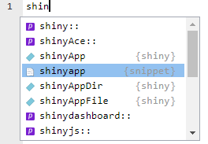
```


---

# Construyendo una Shiny app

```{r shiny, echo=FALSE, fig.align="center", out.width='50%'}
knitr::include_graphics("cheat1.png")
```

--

.pull-left[

**UI**

1. Añadí la plantilla -> ***app.R***

1. Selecciona una función de diseño (_layout_) 

1. Selecciona y organiza los inputs 

]
--
.pull-right[

**Server**

1. Referite a las entradas esperadas usando `input$<id>`

1. Selecciona las funciones `render*()` y `*Output()` 

1. Referite a las salidas esperadas usando `output$<id>`


]

---

# Ejecutá la Shinyapp 🎬

* Dale click al botón `Run App` en la barra de tareas.


```{r run, echo=FALSE, fig.align="center", out.width='25%'}
knitr::include_graphics("run_app.png")
```


* Usa un atajo del teclado: Cmd/Ctrl + Shift + Enter.

* Ejecuta `shiny::runApp()` incluyendo la ruta al archivo  **app.R**

.footnote[Source: https://mastering-shiny.org/basic-app.html]

---

# Guía Rápida

[¡Click de descarga de la versión en español!](https://github.com/rstudio/cheatsheets/raw/master/translations/spanish/shiny_Spanish.pdf)

```{r rstudio_cheat, echo=FALSE, fig.align="center", out.width='80%'}
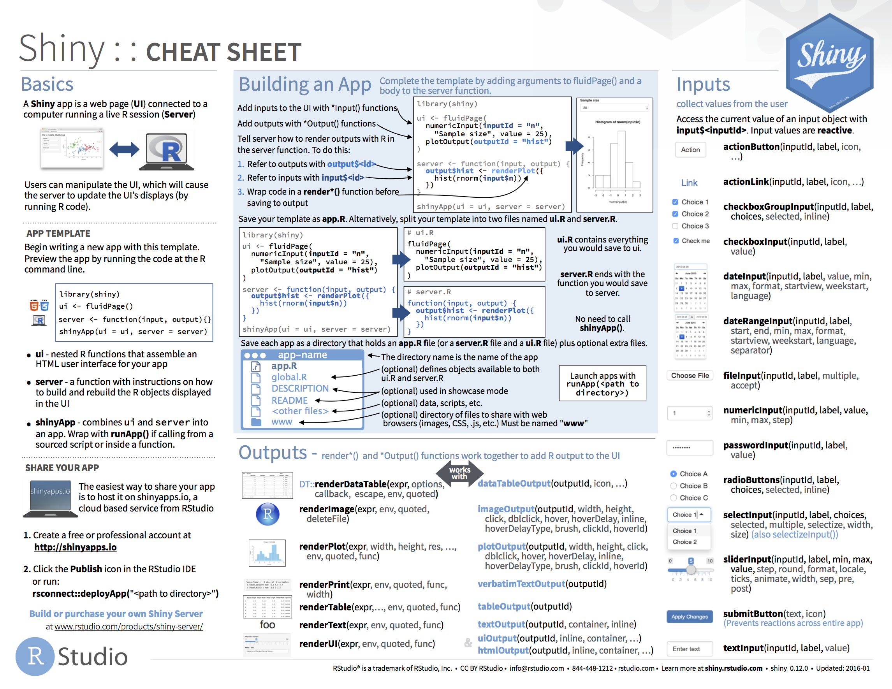
```


---

class: center, middle

# User Interfase (UI)

```{r mamus, echo=FALSE, fig.align="center", out.width='90%'}
knitr::include_graphics("mamu_4.jpg")
```

---

# ¿Qué es la interfaz de usuario?

> La UI es dónde se define cómo se verá su aplicación. 

--

> Las funciones de Shiny que usas en la UI serán traducidas a código HTML y CSS que los navegadores web pueden leer y representar en forma de una aplicación web.


---

# ¿Cómo organizo la UI?

--
### ➕ Paneles

- Agrego capas 🧅 

--

### ➕ Funciones de diseño 

- Organizo los elementos dentro de la estructura elegida (arriba, bajo, derecha, izquierda, etc)


---


class: center, middle, inverse

# Alternando entre paneles

---

# Organizando la app en capas

.left-column[
```{r adentro5, echo=FALSE, fig.align="center", out.width=300}
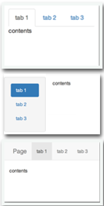
```
]
 .right-column[
Se puede organizar la información en paneles con
* `tabsetPanel()`
* `navlistPage()` 
* `navbarPage()`.

```{r eval=FALSE, include=TRUE}
ui <- fluidPage(tabsetPanel(
     tabPanel("tab 1", "contenido"),
     tabPanel("tab 2", "contenido"),
     tabPanel("tab 3", "contenido")))

```

]

---

class: center, middle, inverse

# Funciones de diseño (*layout*)

---

# Diseño

Organiza los paneles y elementos dentro del diseño (_layout_) de UI que elegiste usando una **función de diseño**

```{r init3, echo=FALSE, fig.align="center", out.width='90%'}
knitr::include_graphics("layout.png")
```

.footnote[Source: Guía Rápida Shiny - RStudio.]

---

class: center, middle

```{r init5, echo=FALSE, fig.align="center", out.width='100%'}
knitr::include_graphics("slide_mamu1.png")
```

`ui <- fluidPage(sidebarLayout(sidebarPanel(…), mainPanel(…))`

---

# Pestañas y diseño de paneles


```{r eval=FALSE, include=TRUE}

ui <- fluidPage(navbarPage(title = "Datos",
                           tabPanel(title = "panel 1", 
                                    sidebarLayout( #<<
                                    sidebarPanel(),#<<
                             mainPanel()) #<<
                             ), 
                           tabPanel(title = "panel 2", 
                                    sidebarLayout( #<<
                                    sidebarPanel(),#<< 
                             mainPanel())) #<<
                           ))
```

--
* Estructura de una app que pose una barra de navegación `navbarPage()` con dos paneles `tabPanel()`.

--
* Dentro de cada panel hay una función de diseño `sidebarLayout()` que permite incluir una barra lateral `sidebarPanel()` y un area principal `mainPanel()`

---

class: center, middle, inverse

## Controles de entrada (*input control*)

---

## Funciones de control del entrada (*input control*)

Colecta los valores elegidos por el usuario

```{r init4, echo=FALSE, fig.align="center", out.width='100%'}
knitr::include_graphics("inputs.png")
```

.footnote[Source: Guía Rápida Shiny - RStudio.]
---

# ¿Cómo elegir?


```{r uinig, echo=FALSE, fig.align="center", out.width='70%'}
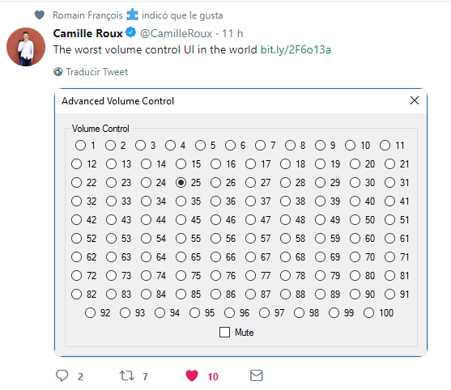
```

---

class: center, middle

# Usando funciones de diseño

```{r radiobut, echo=FALSE, fig.align="center", out.width='90%'}
knitr::include_graphics("slide_mamu2.png")
```

`ui <- fluidPage(sidebarLayout(sidebarPanel(radioButtons(…)), mainPanel(…))`

---
# Selección de valores de entrada (*inputs*)🎚

Argumentos de la función `radioButtons()` 

```{r eval=FALSE, tidy=FALSE}

radioButtons(inputId = `"axis_x"`, 
             label = `"X"`, 
             choices = c("Highway fuel economy (mpg)" = "hwy",
                         "Engine displacement (L)" = "displ",
                         "Car type" = "class"))


```

---

class: center, middle

Ten cuidado cuando organizas la app

```{r init7, echo=FALSE, fig.align="center", out.width='90%'}
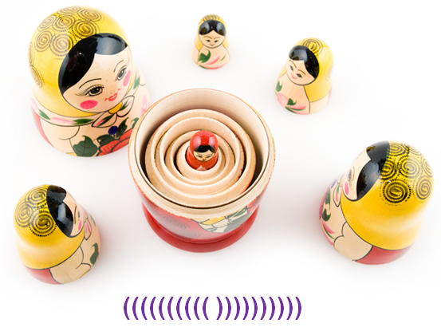
```

---

class: center, middle

# ⚠️ ¡Cuidado!  

Las familias pueden ser complejas

```{r families, echo=FALSE, fig.align="center", out.width='70%'}

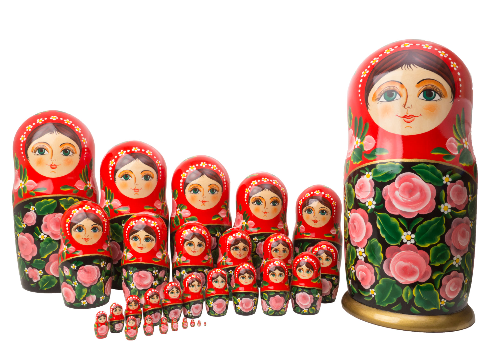

```

---

class: center, middle

```{r ini3, echo=FALSE, fig.align="center", out.width='90%'}

knitr::include_graphics("closing_par.png")

```


---

class: center, middle

Puedes mirar ejemplos con código de las partes que pueden componer una UI en la siguiente página: [Demos](https://shiny.rstudio.com/gallery/#demos)


```{r adentro, echo=FALSE, fig.align="center", out.width='90%'}

```

---

class: center, middle

# Modificaciones a la interfaz de usuario


```{r title_extras, echo=FALSE, fig.align="center", out.width='70%'}

```

---

# Incluí una imagen

1. Agrega el archivo de la imagen dentro de una carpeta llamada ***www*** 
1. Agrega el siguiente código para posicionar la imagen en la UI `img(src="<file name>")`


```{r hola, echo=FALSE, fig.align="center", out.width='90%'}
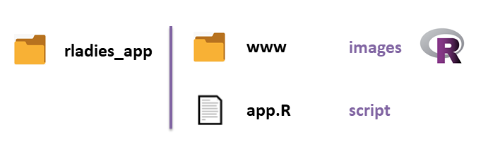
```


---

## Agrega un tema: 📦 `shinythemes `

```{r theme, echo=FALSE, fig.align="center", out.width='70%'}
knitr::include_graphics("shinythemes.png")
```

---

## Agrega un tema: 📦 `shinythemes `

```{r eval=FALSE, tidy=FALSE}
ui<- fluidPage(theme = shinytheme("lumen"), #<<
               h1(strong("R-Ladies Buenos Aires")), 
               h4(em("Shiny meetup")), 
     sidebarLayout( sidebarPanel( radioButtons(…) ),
                                  mainPanel(… ))

```
---

# Agrega un tema: boostrap


Se agrega el archivo .css a una carpeta `www` (similar a lo que haciamos con las imagenes)

¿Dónde encuentro temas? https://bootswatch.com/


```{r eval=FALSE, tidy=FALSE}
ui<- fluidPage(theme = "file.css", #<< #En la carpeta www
               h1(strong("R-Ladies Buenos Aires")), 
               h4(em("Shiny meetup")),
     sidebarLayout( sidebarPanel( radioButtons(…) ),
                                  mainPanel(… ))

```

---

# Agrega un título

```{r eval=FALSE, tidy=FALSE}
ui<- fluidPage(theme = shinytheme("lumen"), 
               h1(strong("R-Ladies Buenos Aires")), #<<
               h4(em("Shiny meetup")), #<<
     sidebarLayout( sidebarPanel( radioButtons(…) ),
                                  mainPanel(… ))

```


```{r header_1, echo=FALSE, fig.align= "center", fig.height=3, fig.width=4}
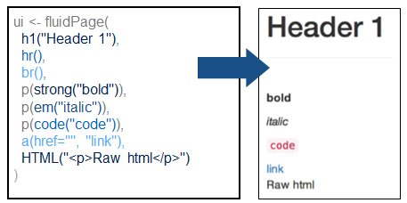
```

.footnote[Source: Shiny RStudio Cheatsheet.]

---

## Esperando: 📦 `Waiter`

Barras o indicadores de espera giratorios. [Ejemplos](https://shiny.john-coene.com/waiter/)

```{r waiter, echo=FALSE, fig.align= "center", out.height=300, out.width=300}

```

Ejemplos de [`spinners`](https://shiny.john-coene.com/waiter/)

---

## Esperando: 📦 `shinycssloaders`

[Demo](https://daattali.com/shiny/shinycssloaders-demo/) 

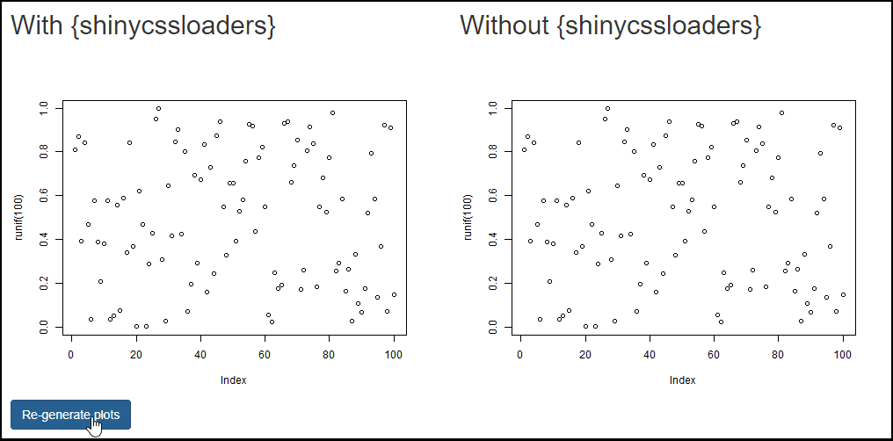

.footnote[[extraído de la página oficial de shinycsloaders](https://github.com/daattali/shinycssloaders)]
---

# Esperando: 📦 `shinycustomloader`

Ejemplos que incluyen [imagenes predeterminadas, pacmans y nubes de palabras](https://emitanaka.org/shinycustomloader/)


```{r waiter2, echo=FALSE, fig.align= "center", out.height=300, out.width=300}
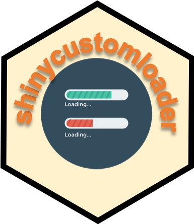
```

---


class: center, middle

# Servidor y Reactividad


```{r title_react2, echo=FALSE, fig.align="center", out.width='100%'}

```


---

```{r reactserv, echo=FALSE, fig.align="center", out.width='40%'}
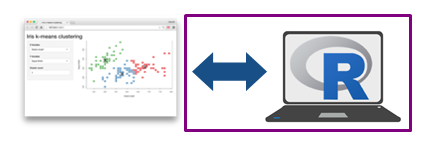
```

.pull-left[

**UI**

1. Añadí la plantilla -> ***app.R*** 

1. Selecciona una función de diseño (_layout_) 

1. Selecciona y organiza los inputs 

]

.pull-right[

**Server**

1. Referite a las entradas esperadas usando `input$<id>`

1. Selecciona las funciones `render*()` y `*Output()` adecuadas 

1. Referite a las salidas esperadas usando `output$<id>`


]

---

# Servidor

> Es en la función del servidor donde utilizarán los valores que los usuarios ingresaron para recrear resultados, obteniendo por ejemplo gráficos, tablas o texto.

--

>Cada salida se guardará en un objeto especial llamado `output` el cual correctamente identificado se podrá referenciar en la UI para ubicarlo en la shiny app.
 
---

## Paso1: Chequear que el código corre de antemano ✅

```{r plot1, echo=TRUE, fig.width=7, fig.height=5, fig.align = "center" }
library(ggplot2)

ggplot(data = mpg)+
  geom_point(mapping = aes(x = displ,
                           y = hwy,
                           color = class))
```

---

class: center, middle, inverse
### 🔌 Conecta la elección del usuario con el código en el servidor, y luego el código del servidor con la UI 🤔🤯


---


```{r react, echo=FALSE, fig.align="center", out.width='90%'}
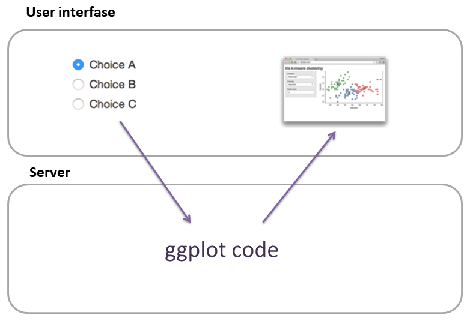
```
---

class: center, middle, inverse
# 🔌 Conecta la elección en pantalla del usuario con el código en el servidor ✅


---
## Paso2: Referite a los valores de entrada (*inputs*) usando `input$<id>`

```{r react2, echo=FALSE, fig.align="center", out.width='90%'}
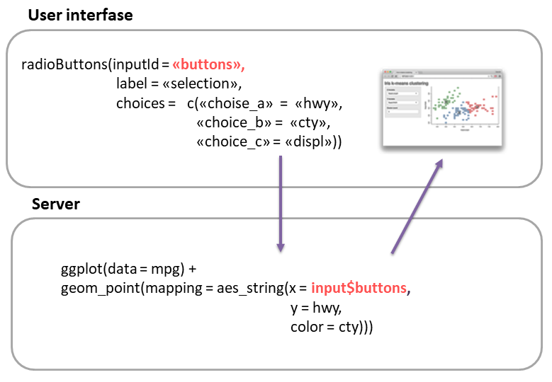
``` 

---


class: center, middle, inverse
# 🔌 Conecta el código en el servidor con lo que el usuario verá en la pantalla ✅

---


```{r react3, echo=FALSE, fig.align="center", out.width='90%'}

```
---

## Paso 3: Elegí las funciones `render*()` y `*Output()` 

Conectan el código del servidor con la salida en pantalla.

```{r out, echo=FALSE, fig.align="center", out.width='90%'}
knitr::include_graphics("outputs.png")
```

---

## Paso 4: Referite a las salidas usando `output$<id>`

Observa las funciones `render*()` y `*Output()` 

```{r react4, echo=FALSE, fig.align="center", out.width='90%'}
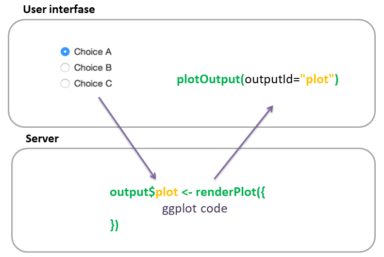
```

---

# ¡Completamos la UI!

En este caso, el gráfico se verá dentro del panel general ya que lo ubique dentro de `mainPanel()`.

```{r mamu3, echo=FALSE, fig.align="center", out.width='90%'}
knitr::include_graphics("slide_mamu3.png")
```

---


class: inverse, center, middle

# 💻 ¡¡Comparte tu shiny app!


---

# ¡Comparte tu shiny app!

**1. shinyapps.io** 

- Gratis hasta 5 apps
- Debes crearte una cuenta en [shinyapps.io](shinyapps.io)
- Integrado a la consola de RStudio

--

**2. Binder**

- Apps gratis ilimitadas
- Solo puedes preinstalar paquetes que estan en CRAN
- Limitaciones en las versiones de R que puedes usar

[Blog en español ¿Cómo aprender a usar Binder en tu Shiny app?](https://florencia.netlify.app/es-es/2020/08/compartiendo-entornos-interactivos-y-reproducibles-en-r-con-binder.es-es/)


---

# ¡Comparte tu shiny app!


**3. Arma un paquete 📦**

- Puedes aprender sobre cómo armar un paquete básico en este [libro](https://r-pkgs.org/whole-game.html)
- Debes generar una función que llame a la app.

--

- No implica necesariamente subirlo a CRAN, pueden instalarlo directamente desde R si lo dejas en un repositorio público como GitHub.
- Una forma más completa de dejar tu app como 📦 es usar `golem`. Puedes leer más sobre esto aquí: [Engineering Production-Grade Shiny Apps](https://engineering-shiny.org/)


```{r golem, echo=FALSE, fig.align="center", out.height=100, out.width=100}
knitr::include_graphics("golem.png")
```


---

class: inverse, center, middle

### Shiny app para meetup de R-Ladies

Aplicaciones web interactivas con Shiny - [Material para un meetup](  https://florencia.netlify.app/es-es/2020/02/intro_shiny.es-es/)
https://github.com/flor14/rladies_shiny_meetup_2020.git

```{r finalapp, echo=FALSE, fig.align="center", out.width='90%'}
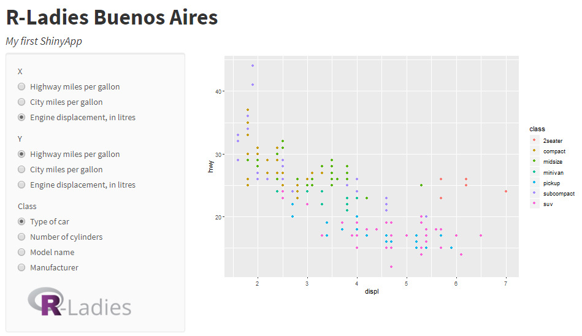
```


---

class: inverse, center, middle

### Shiny app para Taller de Shiny en LatinR 2020

Vilma Romero, Juan Cruz Rodríguez y Florencia D'Andrea
https://github.com/flor14/latinr_shiny_2020.git


```{r finalapp2, echo=FALSE, fig.align="center", out.width='90%'}
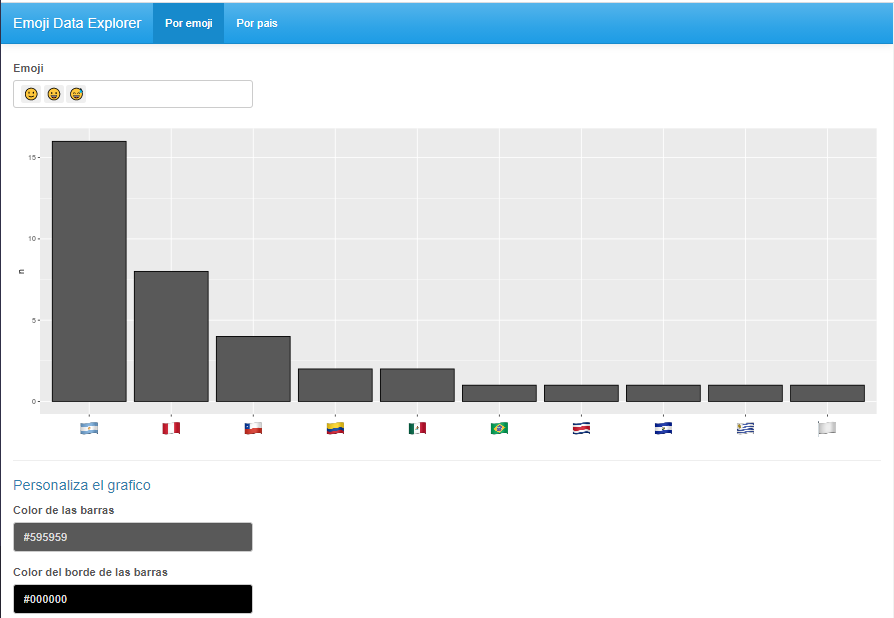
```

---

class: center, middle

# Ejemplos
 
[RStudio Shiny Gallery](https://shiny.rstudio.com/gallery/)

[Ganadores del primer concurso de Shiny apps (2019)](https://blog.rstudio.com/2019/04/05/first-shiny-contest-winners/)

[Ganadores del segundo concurso de Shiny Apps (2020)](https://blog.rstudio.com/2020/07/13/winners-of-the-2nd-shiny-contest/)


---

class: center, middle

# Algunos links
 
 [Mastering Shiny](https://mastering-shiny.org/)
 
 [Engineering Production-Grade Shiny Apps](https://engineering-shiny.org/)
 
 [Referencia de funciones de Shiny](https://shiny.rstudio.com/reference/shiny/1.5.0/)
 
 [Shiny's Holy Grail - UseR! 2019 - Joe Cheng  video](https://www.youtube.com/watch?v=5KByRC6eqC8)
 
 [Tutorial R-Studio](https://shiny.rstudio.com/tutorial)

 [Javascript for Shiny Users](https://github.com/rstudio-conf-2020/js-for-shiny)

---

class: center, middle

# ¡Muchas gracias!


Slides created via the R package [**xaringan**](https://github.com/yihui/xaringan).

The Template comes from [Allison Horst](https://remarkjs.com)

