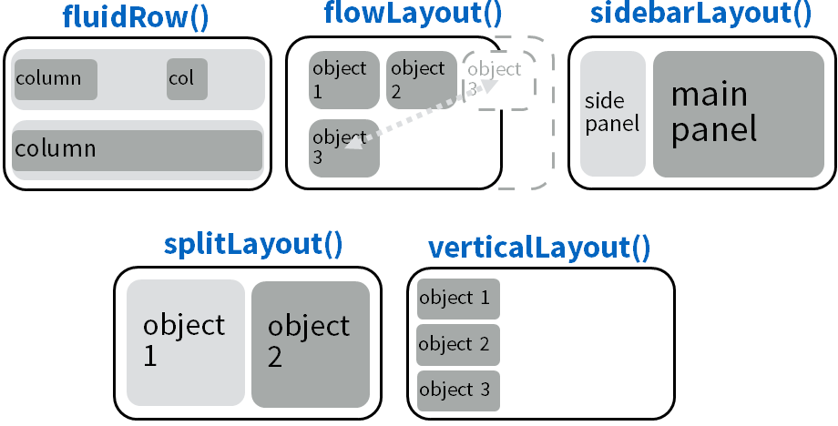
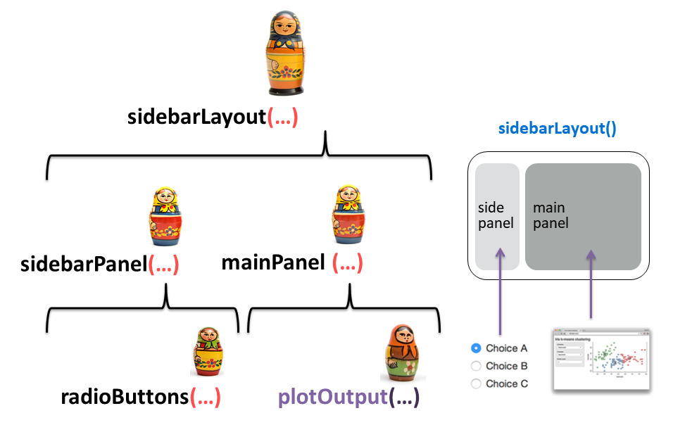

```{r setup, include=FALSE}
options(htmltools.dir.version = FALSE)
```


```{r share-again, echo=FALSE}
xaringanExtra::use_share_again()
```

```{r xaringan-themer, include=FALSE, warning=FALSE}
library(xaringanthemer)
style_mono_accent(
  base_color = "#43418A",
  link_color = "#cabdff" , 
  header_font_google = google_font("Josefin Sans"),
  text_font_google   = google_font("Montserrat", "300", "300i"),
  code_font_google   = google_font("Fira Mono")
)
```

class: center, middle

# Licencia

<a rel="license" href="http://creativecommons.org/licenses/by-sa/4.0/"></a><br />This work is licensed under a <a rel="license" href="http://creativecommons.org/licenses/by-sa/4.0/">Creative Commons Attribution-ShareAlike 4.0 International License</a>.

---

class: center, inverse, bottom
background-image: url("Shiny_grande.jpg")
background-position: 50% 50%

## Aplicaciones Web Interactivas con R

---

# ¡Comencemos!

Una Shiny App  es una página web (UI) conectada a una computadora que ejecuta una sesión de R en vivo (Server)


```{r init, echo=FALSE, fig.align="center", out.width='50%'}
knitr::include_graphics("cheat1.png")
```

--

Los usuarios pueden manipular la UI,  lo cual lleva al server (_servidor_) a enviar una actualización de la UI exhibida (mediante ejecución de código en R).


.footnote[Source: Guía Rápida Shiny - RStudio.]

---

# App.R 📄


```{r eval=FALSE, tidy=FALSE}

library(shiny)

# User interfase
UI <- fluidPage( ) 

# Server
Server <- function(input, output){      }

# Combines UI and server
shinyApp (ui = ui, server = server)

```

---

# Snippets

Podes insertar el template usando la plantilla precargada

```{r init2, echo=FALSE, fig.align="center", out.width='25%'}
knitr::include_graphics("snippet_2.png")
```


---

# Construyendo una Shiny app

```{r shiny, echo=FALSE, fig.align="center", out.width='50%'}
knitr::include_graphics("cheat1.png")
```

--

.pull-left[

**UI**

1. Añadí la plantilla -> ***app.R***

1. Selecciona una función de diseño (_layout_) 

1. Selecciona y organiza los inputs 

]
--
.pull-right[

**Server**

1. Selecciona las funciones `render*()` y `*Output()` 

1. Referite a las salidas esperadas usando `output$<id>`

1. Referite a las entradas esperadas usando `input$<id>`

]

---

# Ejecutá la Shinyapp 🎬

* Dale click al botón `Run App` en la barra de tareas.


```{r run, echo=FALSE, fig.align="center", out.width='25%'}
knitr::include_graphics("run_app.png")
```


* Usa un atajo del teclado: Cmd/Ctrl + Shift + Enter.

* Ejecuta `shiny::runApp()` incluyendo la ruta al archivo  **app.R**

.footnote[Source: https://mastering-shiny.org/basic-app.html]

---

# Guía Rápida


```{r rstudio_cheat, echo=FALSE, fig.align="center", out.width='80%'}

```

.footnote[¡Click aquí!: https://shiny.rstudio.com/articles/cheatsheet.html]


---

class: center, middle

# User Interfase (UI)

```{r mamus, echo=FALSE, fig.align="center", out.width='90%'}

```
---

class: center, middle, inverse

# Funciones de diseño (*layout*)
---

# Diseño

Organiza los paneles y elementos dentro del diseño (_layout_) de UI que elegiste usando una **función de diseño**

```{r init3, echo=FALSE, fig.align="center", out.width='90%'}

```

.footnote[Source: Guía Rápida Shiny - RStudio.]

---

class: center, middle

```{r init5, echo=FALSE, fig.align="center", out.width='100%'}
knitr::include_graphics("slide_mamu1.png")
```

`Ui <- fluidPage(sidebarLayout(sidebarPanel(…), mainPanel(…))`


---

class: center, middle, inverse

# Inputs

---

# Inputs

Collect values from the user

```{r init4, echo=FALSE, fig.align="center", out.width='100%'}
knitr::include_graphics("inputs.png")
```

.footnote[Source: Guía Rápida Shiny - RStudio.]
---

class: center, middle

```{r radiobut, echo=FALSE, fig.align="center", out.width='90%'}
knitr::include_graphics("slide_mamu2.png")
```

`Ui <- fluidPage(sidebarLayout(sidebarPanel(radioButtons(…)), mainPanel(…))`

---
# Selección de inputs por el usuarie

Argumentos de la función `radioButtons()` 

```{r eval=FALSE, tidy=FALSE}

radioButtons(inputId = `"axis_x"`, 
             label = `"X"`, 
             choices = c("Highway fuel economy (mpg)" = "hwy",
                         "Engine displacement (L)" = "displ",
                         "Car type" = "class"))


```

---

class: center, middle

```{r init7, echo=FALSE, fig.align="center", out.width='90%'}
knitr::include_graphics("parentesis.png")
```

---

class: center, middle

# ⚠️ ¡Cuidado!  

Las familias pueden ser complejas

```{r families, echo=FALSE, fig.align="center", out.width='70%'}

knitr::include_graphics("complex.jpg")

```

---

class: center, middle

```{r ini3, echo=FALSE, fig.align="center", out.width='90%'}

knitr::include_graphics("closing_par.png")

```

---


class: center, middle, inverse

# Tabset panel

---

# Paneles

.left-column[
```{r adentro5, echo=FALSE, fig.align="center", out.width=300}

```
]
 .right-column[
Se puede organizar la información en paneles con `tabsetPanel()`, `navlistPage()` o `navbarPage()`.

```{r eval=FALSE, include=TRUE}
ui <- fluidPage(tabsetPanel(
     tabPanel("tab 1", "contenido"),
     tabPanel("tab 2", "contenido"),
     tabPanel("tab 3", "contenido")))

```

]

---

class: center, middle

```{r adentro, echo=FALSE, fig.align="center", out.width='90%'}

```


---

class: center, middle, inverse

# Para ejemplos de todo esto
[Demos](https://shiny.rstudio.com/gallery/#demos)

---


class: center, middle

# Modificaciones a la interfaz de usuario


```{r title_extras, echo=FALSE, fig.align="center", out.width='70%'}
knitr::include_graphics("mamu_1.jpg")
```

---

# Incluí una imagen

1. Agrega el archivo de la imagen dentro de una carpeta llamada ***www*** 
1. Agrega el siguiente código para posicionar la imagen en la UI `img(src="<file name>")`


```{r hola, echo=FALSE, fig.align="center", out.width='90%'}
knitr::include_graphics("structure.png")
```


---

# Agrega un tema:`shinythemes `

```{r theme, echo=FALSE, fig.align="center", out.width='70%'}
knitr::include_graphics("shinythemes.png")
```

---

# Agrega un tema:`shinythemes `

```{r eval=FALSE, tidy=FALSE}
ui<- fluidPage(theme = shinytheme("lumen"), #<<
               h1(strong("R-Ladies Buenos Aires")), 
               h4(em("Shiny meetup")), 
     sidebarLayout( sidebarPanel( radioButtons(…) ),
                                  mainPanel(… ))

```
---

# Agrega un tema: boostrap


Se agrega el archivo .css a una carpeta `www` (similar a lo que haciamos con las imagenes)

¿Dónde encuentro temas? https://bootswatch.com/


```{r eval=FALSE, tidy=FALSE}
ui<- fluidPage(theme = "file.css", #<< #En la carpeta www
               h1(strong("R-Ladies Buenos Aires")), 
               h4(em("Shiny meetup")),
     sidebarLayout( sidebarPanel( radioButtons(…) ),
                                  mainPanel(… ))

```

---

# Agrega un título

```{r eval=FALSE, tidy=FALSE}
ui<- fluidPage(theme = shinytheme("lumen"), 
               h1(strong("R-Ladies Buenos Aires")), #<<
               h4(em("Shiny meetup")), #<<
     sidebarLayout( sidebarPanel( radioButtons(…) ),
                                  mainPanel(… ))

```


```{r header_1, echo=FALSE, fig.align= "center", fig.height=3, fig.width=4}
knitr::include_graphics("header.png")
```

.footnote[Source: Shiny RStudio Cheatsheet.]

---

## Esperando: `Waiter`

Barras o indicadores de espera giratorios. [Ejemplos](https://shiny.john-coene.com/waiter/)

```{r waiter, echo=FALSE, fig.align= "center", out.height=300, out.width=300}
knitr::include_graphics("waiter.png")
```

Ejemplos de [`spinners`](https://shiny.john-coene.com/waiter/)

---

## Esperando: `shinycssloaders`

[Demo](https://daattali.com/shiny/shinycssloaders-demo/) 


.footnote[[extraído de la página oficial de shinycsloaders](https://github.com/daattali/shinycssloaders)]
---

# Esperando: `shinycustomloader`

Ejemplos que incluyen [imagenes predeterminadas, pacmans y nubes de palabras](https://emitanaka.org/shinycustomloader/)


```{r waiter2, echo=FALSE, fig.align= "center", out.height=300, out.width=300}
knitr::include_graphics("shinycustom.png")
```

---

# `req()`

Evita la ejecución antes que se seleccione la primer opción


---


class: center, middle

# Reactividad


```{r title_react2, echo=FALSE, fig.align="center", out.width='100%'}
knitr::include_graphics("mamu_2.jpg")
```


---

```{r reactserv, echo=FALSE, fig.align="center", out.width='40%'}
knitr::include_graphics("server_react.png")
```

.pull-left[

**UI**

1. Añadí la plantilla -> ***app.R*** 

1. Selecciona una función de diseño (_layout_) 

1. Selecciona y organiza los inputs 

]

.pull-right[

**Server**

1. Selecciona las funciones `render*()` y `*Output()` adecuadas 

1. Referite a las salidas esperadas usando `output$<id>`

1. Referite a las entradas esperadas usando `input$<id>`

]

---

# Funciones `render*()` y `*Output()` 


```{r out, echo=FALSE, fig.align="center", out.width='90%'}
knitr::include_graphics("outputs.png")
```

---

# Gráfico

```{r plot1, echo=TRUE, fig.width=7, fig.height=5, fig.align = "center" }
library(ggplot2)

ggplot(data = mpg)+
  geom_point(mapping = aes(x = displ,
                           y = hwy,
                           color = class))
```

---

## Referite a las entradas (*inputs*) usando `input$<id>`

```{r react, echo=FALSE, fig.align="center", out.width='90%'}
knitr::include_graphics("reactivity.png")
```

---

## Referite a las entradas usando `input$<id>`

```{r react2, echo=FALSE, fig.align="center", out.width='90%'}
knitr::include_graphics("reactivity3.png")
```

---

## Referite a las salidas usando `output$<id>`

```{r react3, echo=FALSE, fig.align="center", out.width='90%'}
knitr::include_graphics("reactivity.png")
```

---

## Referite a las salidas usando `output$<id>`

Observa las funciones `render*()` y `*Output()` 

```{r react4, echo=FALSE, fig.align="center", out.width='90%'}

```

---

```{r mamu3, echo=FALSE, fig.align="center", out.width='90%'}

```

---


---

class: inverse, center, middle

```{r finalapwp, echo=FALSE, fig.align="center", out.width='90%'}
knitr::include_graphics("appfinal.png")
```

---

class: inverse, center, middle


```{r finalapp, echo=FALSE, fig.align="center", out.width='90%'}
knitr::include_graphics("appfinal.png")
```


---

class: inverse, center, middle

# Repo

https://github.com/flor14/rladies_shiny_meetup_2020


---

class: inverse, center, middle

# Ejemplos
 
[RStudio Shiny Gallery](https://shiny.rstudio.com/gallery/)

[Winners of the 1st Shiny Contest](https://blog.rstudio.com/2019/04/05/first-shiny-contest-winners/)


---

# Golem


---

# Otros paquetes

ShinyMobile


---

class: inverse, center, middle

# Links
 
 [Mastering Shiny](https://mastering-shiny.org/)
 
 [Shiny's Holy Grail - UseR! 2019 - Joe Cheng  video](https://www.youtube.com/watch?v=5KByRC6eqC8)
 
 [Podcast Shiny]()

 [Tutorial R-Studio](https://shiny.rstudio.com/tutorial)

 [Javascript for Shiny Users](https://github.com/rstudio-conf-2020/js-for-shiny)

[Golem Package](https://github.com/ThinkR-open/golem)

[Shinytest](https://rstudio.github.io/shinytest/articles/package.html)

---

class: center, middle

# ¡Muchas gracias!

[Florencia](@cantoflor_87)


Slides created via the R package [**xaringan**](https://github.com/yihui/xaringan).

The Template comes from [Allison Horst](https://remarkjs.com)

